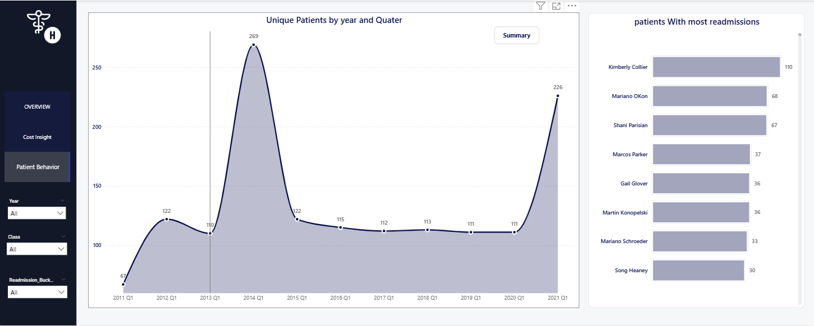

# Massachusetts General Hospital – Healthcare Analytics  

---

## 📑 Table of Contents  
1. [Introduction](#1-introduction)  
2. [Project Description](#2-project-description)  
3. [Project Aim](#3-project-aim)  
4. [About the Dataset](#4-about-the-dataset)  
5. [Tools Used](#5-tools-used)  
6. [Importing the Dataset](#6-importing-the-dataset)  
7. [Data Cleaning & Transformation](#7-data-cleaning--transformation)  
8. [Data Modeling](#8-data-modeling)  
9. [Data Analysis](#9-data-analysis)  
10. [Dashboards & Insights](#-dashboards--insights)  
   - [1. Overview Dashboard](#-1-overview-dashboard)  
   - [2. Cost & Coverage Insights Dashboard](#-2-cost--coverage-insights-dashboard)  
   - [3. Patient Behavior Dashboard](#-3-patient-behavior-dashboard)  
11. [Key Recommendations](#11-key-recommendations)  
12. [Conclusion](#12-conclusion)  
13. [Contact Information](#13-contact-information) 

---

## 1. Introduction  
This project analyzes synthetic patient and hospital encounter records from Massachusetts General Hospital (2011–2022). The goal is to provide actionable insights to improve hospital operations, reduce costs, and enhance patient outcomes.  

---

## 2. Project Description  
The project covers:  
- Data cleaning and transformation in SQL  
- Analytical queries to answer defined business questions  
- Building dashboards in Power BI to communicate insights  
- Recommendations for stakeholders  

---

## 3. Project Aim  
To identify encounter trends, cost drivers, and patient behaviors that impact hospital resource utilization and care quality.  

---

## 4. About the Dataset  
- **Source:** Synthetic dataset (Massachusetts General Hospital)  
- **Records:** ~27,891 encounters, 974 patients  
- **Key Tables:** Patients, Encounters, Payers, Procedures, Dictionary  
- **Fields:** Demographics, encounter class, costs, insurance coverage, procedure codes  

---

## 5. Tools Used  
- Microsoft Excel (exploration)  
- SQL (MySQL – data cleaning & analysis)  
- Power BI (dashboards & storytelling)  

---

## 6. Importing the Dataset  
- CSVs loaded into MySQL staging tables  
- Cleaned and standardized in SQL  
- Imported curated tables into Power BI for dashboarding  

---

## 7. Data Cleaning & Transformation  
- Removed duplicates and empty rows  
- Standardized gender, marital status, and encounter class  
- Converted text-based dates into proper datetime formats  
- Fixed inconsistent procedure codes  
- Removed unnecessary staging fields  

---

## 8. Data Modeling  
- Built a star schema in Power BI:  
  - **Fact table:** Encounters  
  - **Dimensions:** Patients, Payers, Procedures, DimDate, DimEncounterClass  
- Created DAX measures for KPIs (Encounters YoY%, MoM%, Avg Claim Cost, etc.)  

---

## 9. Data Analysis  
Key metrics analyzed:  
- Encounters by year & class  
- Encounter duration (>24hrs vs ≤24hrs)  
- Zero payer coverage cases  
- Procedure frequency and costs  
- Readmissions within 30 days  
- Unique patients per quarter  

---

## 📈 Dashboards & Insights  

### 🔹 1. Overview Dashboard  
 

**Key Insights**  
- 27,891 total encounters, 974 unique patients  
- Ambulatory encounters = **44.95%**, followed by Outpatient (22.59%) and Urgent Care (13.14%)  
- YoY encounters increased by **40.13%**, MoM growth was modest at 1.64%  
- Peak encounters: **2014 (3,885)**; peak patients: **2014 Q1 (269)**, over 300% higher than 2011 Q1 (67)  

---

### 🔹 2. Cost & Coverage Insights Dashboard  

**Key Insights**  
- Avg base cost per procedure = **$2,092**  
- Highest avg base cost procedure = **$21,111**  
- No-insurance patients have the **highest avg claim cost** ($4,920); dual-eligible patients the lowest ($1,551)  
- Payer coverage: **48.23%**; Self-pay encounters: **1,460**  
- Coronary artery bypass grafting = most expensive procedure (**$56,169**)  

---

### 🔹 3. Patient Behavior Dashboard  
 

**Key Insights**  
- Repeat encounter rate: **28.64%**  
- Readmissions within 30 days: **13,138**  
- Top readmitted patient (Kimberly Collier) accounted for **3.63%** of all encounters  
- Patient volumes peaked in **2014 Q1**; variability observed across years  
- Subset of patients drive disproportionate encounters → opportunity for **targeted care management**  

---

## 11. Key Recommendations  
- Reduce uninsured encounters by introducing financial assistance programs.  
- Target care management for frequent readmission patients.  
- Optimize resources for costly inpatient encounters.  
- Prepare staff/resources for seasonal peaks in patient volume.  

---

## 12. Conclusion  
The dashboards highlight operational and financial challenges. Addressing cost inefficiencies and focusing on high-risk patients can improve hospital performance and patient care outcomes.  

---  

## 13. 📬 Contact Information
👤 [Raymond Kadzashie]  
📧 [rykadzashie@outlook.com]  
💼 [LinkedIn](https://www.linkedin.com/in/raymond-kadzashie/) 
